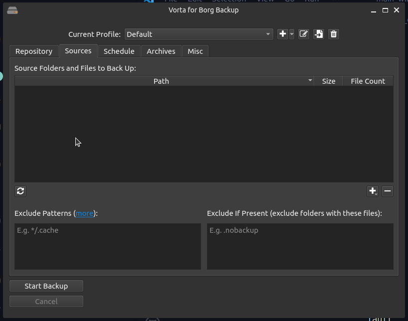
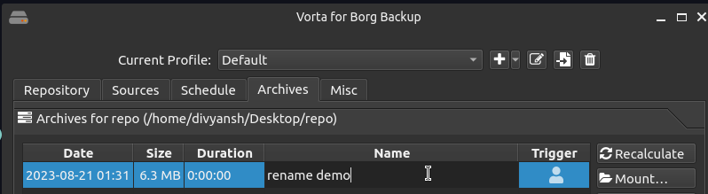
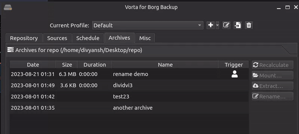
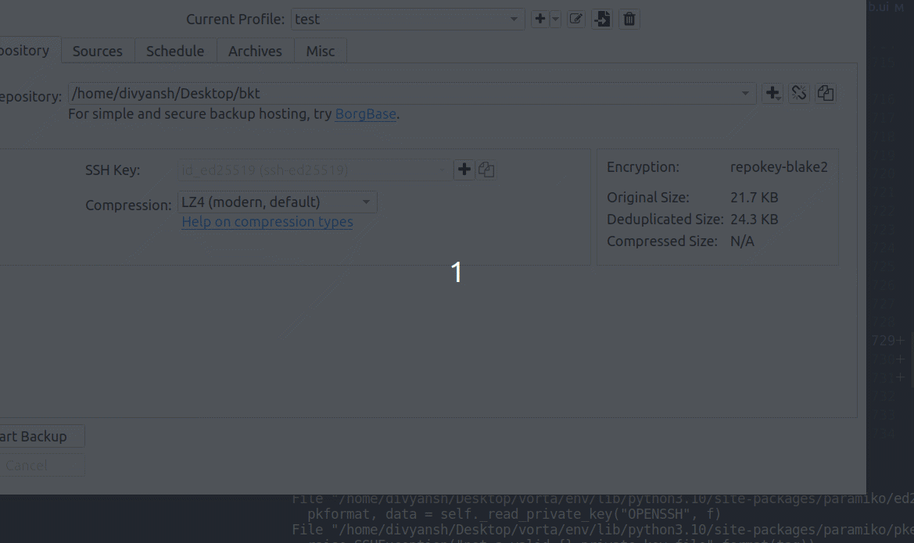
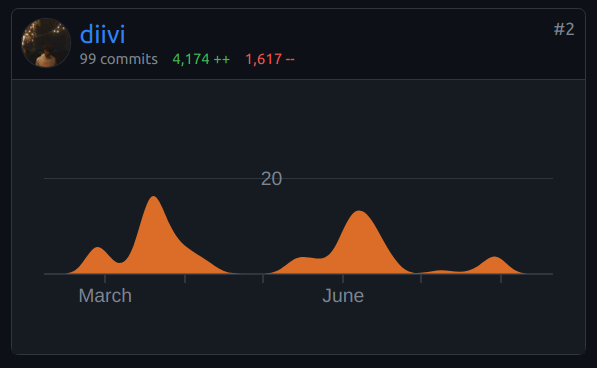
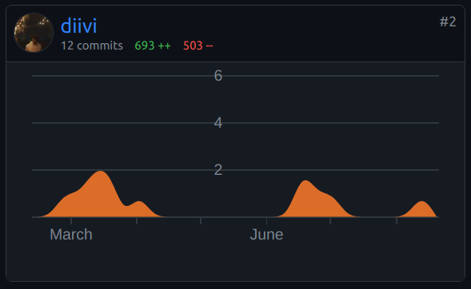

# Google Summer of Code 2023 Final Report
## Python Software Foundation - Borg Collective
 

**Contributor**: [Divyansh Singh (divi)](https://github.com/diivi)

**Proposal Link**: [Borg Collective: Divyansh Singh GSoC 2023 Proposal](https://blogs.python-gsoc.org/media/proposals/GSoC_Proposal_DIvi_2023.pdf)

**Organization**: [Python Software Foundation](https://python-gsoc.org/)

**Sub-Organization**: [Borg Collective](https://github.com/borgbackup/borg)

**Project**: [Borg Collective: Add beginner-friendly features and enhance the capabilities of Vorta & Borgmatic.](https://summerofcode.withgoogle.com/programs/2023/projects/0i8Q6ZrE)

**Mentors**: [Dan Helfman (witten)](https://github.com/witten), [Manuel Riel (m3nu)](https://github.com/m3nu), [Julian Hofer](https://github.com/Hofer-Julian), [real-yfprojects](https://github.com/real-yfprojects)

## Project Overview
Borg Collective is a well-known organization that offers a range of Python-based backup tools, including Borg, Borgmatic, and Vorta.

[Borg](https://github.com/borgbackup/borg) is a powerful file backup tool that performs tasks like compression, encryption, authentication, and data deduplication. It is a command-line tool, and is used by many users and organizations to back up their data.

[Vorta](https://github.com/borgbase/vorta) is a desktop GUI for Borg that makes it easier to interact with it without knowing any CLI commands or other intricacies. It is a cross-platform application that is built using Python and Qt, and is used by beginners and advanced users alike.

[borgmatic](https://github.com/borgmatic-collective/borgmatic) is a CLI wrapper around Borg that stores all Borg settings and preferences inside a configuration file and makes it easy to automate backups. It also extends Borg's capabilities by adding support for running pre and post-backup hooks, setting up monitoring, backing up databases, and more.

With this project, I improved Vorta by adding some essential features that users have frequently requested. I enhanced its user experience, making it easier for beginners to use, also designing and developing new interfaces along the way. 

As for Borgmatic, I expanded its already powerful capabilities, particularly in the areas of database backups and restores. I also helped decrease the number of unresolved issues in the Borgmatic repository and worked closely with project maintainers and users to incorporate more features into the project.

## Project Achievements

1. **A new and improved GUI dialog** in Vorta for managing exclusion rules before creating a backup.

   Before
   
   

   After
   
   [New Exclude GUI](https://github.com/borgbase/vorta/assets/41837037/f7bf556a-77a2-4708-a5ba-a5f6bda1f641)

2. **Enhanced the archive table by adding Quality of Life improvements** like **allowing users to rename an archive by double-clicking on it and pressing enter**, and adding a **new column to display whether the archive was created by the user or by the scheduler.**
   
   Earlier, users had to right-click on an archive, select the "Rename" option in a context menu, and enter the new name in a dialog box, which was not very intuitive, involved a lot of clicks, and was a **bad user experience.**

   Identifying whether an archive was created by the scheduler or by the user was also not possible before, and users had a hard time figuring this out.
   

   Refreshing archives in Vorta recalculates the size of the archive, and also updates the archive table to reflect any other changes in the archive.
   I made it possible for users to **refresh multiple archives at once**, instead of one at a time, which was bad UX, especially for users with a large number of archives. Selecting an archive, clicking "Refresh", waiting for it to finish, and then repeating the process for every archive was a very tedious process.

   

   I added a **"Quick Mount" button** to the archive table, which allows users to mount an archive with a single click to a temporary location. This is useful for **quickly accessing files from a backup archive** without having to restore the entire archive, or creating a folder and then mounting the archive to it.

   
  
3. borgmatic - [Add functionality to support restoring a database dump to a different hostname/port/username than the ones used to create the dump.](https://github.com/borgmatic-collective/borgmatic/pull/73)
   
   Earlier, database dumps created by borgmatic for a particular database could only be restored to the same hostname, port, and username that was used to create the dump. This meant that if the user wanted to restore the dump to a different database, or change even a single parameter, they had to manually edit the dump file and then restore it, which is a long process and is not very user-friendly. And obviously, the user would have to revert the changes made to the configuration file after the restore was complete to avoid any issues with future backups, doubling the work.

   This was a pain point and a frequently requested feature and I worked on adding these parameters to the borgmatic **configuration file and CLI arguments**, so that users could easily change them without having to resort to any workarounds.
   
   I was also responsible for actually **checking and executing the restores** for all the databases that borgmatic supports, namely - **PostgreSQL, MySQL, MariaDB, MongoDB and SQLite**. I learned how to **write tests extensively** for this project, and also how to use **Docker** to test the database restores.

   

4. [Bootstrap a borgmatic restore from nothing](https://github.com/borgmatic-collective/borgmatic/pull/71) - This was another frequently requested feature, that would turn out to be a lifesaver for many users. It allows users to **restore their entire borgmatic-created backup, without having a borgmatic configuration file**. This is useful in cases where the user has lost their configuration file, or if they are trying to restore a backup created by someone else, or even when the user has **lost access to everything** except the backup archive.

   The solution was **designed and implemented completely by me from scratch**, thanks to the trust that Dan had in me. I learned a lot about the internals of borgmatic and Borg while working on this feature, and also how to **write tests** for it. The testing was one of the most challenging parts of this feature, as it required me to mock a lot of things, and I had never written tests so extensively before.

   The solution involved storing the borgmatic configuration file in the backup archive itself, and then using that to restore the backup. This was a very interesting solution, and I learned a lot about how to use Borg to add extra borgmatic metadata to the backup archive.

   I also added a flag to the borgmatic config file that allows users to **disable this feature** if they don't want it, as it can be a security risk in some cases.

   

## What's next?

I learned a lot this GSoC, and made some great connections along the way. I plan to **continue contributing to the Borg Collective**, assisting Dan in maintaining borgmatic, and also helping out with Vorta.

I also aim to **bring and assist new contributors** in getting started with the projects, and to help them with any issues they might face along the way. If the Borg Collective participates in GSoC again, I'd love to help out the new students by **reviewing their proposals and pull requests.**

As for borgmatic and Vorta, future work that I'd like to take up or assist with includes:
1. A button in the exclude GUI that opens up a window to show what the created backup will look like. From @real-yfprojects:
   
   > We could have a button Preview archive instead that opens a view similar to the extract view listing all files that would be archived. This list can be determined using borg create --dry-run.

2. Editing the added exclude rules in the exclude GUI inline, instead of first removing them and then adding them again. Check [this](https://github.com/borgbase/vorta/pull/1742#issuecomment-1680522052) comment for more details.

3. borgmatic supports including external configuration files in the main configuration file, but the bootstrap feature won't work if such a configuration file is used. A solution could be to include the external configuration files in the created archive, just like we do with the main one, so that they can be used to restore the backup.
For more details, check [this](https://projects.torsion.org/borgmatic-collective/borgmatic/issues/736) ticket.

## Challenges and Takeaways

## Acknowledgements

## Pull Requests
A list of all the pull requests I made before and during GSoC, in chronological order of their creation for each project.

### [borgmatic](https://github.com/borgmatic-collective/borgmatic)

- [#50 feat: add dump-restore support for SQLite databases](https://github.com/borgmatic-collective/borgmatic/pull/50)
- [#52 fix: remove extra dark mode styles](https://github.com/borgmatic-collective/borgmatic/pull/52)
- [#53 feat: add optional check for the existence of source directories](https://github.com/borgmatic-collective/borgmatic/pull/53)
- [#54 feat: file:// URLs support](https://github.com/borgmatic-collective/borgmatic/pull/54)
- [#55 fix: rephrase error when running from config](https://github.com/borgmatic-collective/borgmatic/pull/55)
- [#56 fix: no error on database backups without source dirs](https://github.com/borgmatic-collective/borgmatic/pull/56)
- [#57 feat: tag repos](https://github.com/borgmatic-collective/borgmatic/pull/57)
- [#58 docs: copy to clipboard support](https://github.com/borgmatic-collective/borgmatic/pull/58)
- [#59 fix: remove extra links from docs css](https://github.com/borgmatic-collective/borgmatic/pull/59)
- [#60 feat: allow defining custom variables in config file](https://github.com/borgmatic-collective/borgmatic/pull/60)
- [#61 fix: docs cli reference create spelling](https://github.com/borgmatic-collective/borgmatic/pull/61)
- [#62 fix: replace primitive values in config without quotes](https://github.com/borgmatic-collective/borgmatic/pull/62)
- [#63 fix: make check repositories work with dict and str repositories](https://github.com/borgmatic-collective/borgmatic/pull/63)
- [#65 fix: run typos](https://github.com/borgmatic-collective/borgmatic/pull/65)
- [#66 chore: add favicon to documentation](https://github.com/borgmatic-collective/borgmatic/pull/66)
- [#67 feat: restore specific schemas](https://github.com/borgmatic-collective/borgmatic/pull/67)
- [#68 feat: add logfile name to hook context for interpolation](https://github.com/borgmatic-collective/borgmatic/pull/68)
- [#71 feat: store configs used to create an archive in the archive and add borgmatic bootstrap](https://github.com/borgmatic-collective/borgmatic/pull/71)
- [#73 feat: allow restoring to different port/host/username](https://github.com/borgmatic-collective/borgmatic/pull/73)
- [#74 docs: add docs for database restore params and config bootstrap](https://github.com/borgmatic-collective/borgmatic/pull/74)
- [#75 feat: optionally disable config bootstrap](https://github.com/borgmatic-collective/borgmatic/pull/75)

### [Vorta](https://github.com/borgbase/vorta)

- [#1606 feat: remove paramiko](https://github.com/borgbase/vorta/pull/1606)
- [#1609 feat: add a link to the logs folder in borg warnings](https://github.com/borgbase/vorta/pull/1609)
- [#1612 chore: replace print with logging in application.py](https://github.com/borgbase/vorta/pull/1612)
- [#1613 feat: descriptive messages when no sources are selected to backup](https://github.com/borgbase/vorta/pull/1613)
- [#1621 feat: add settings for files list views](https://github.com/borgbase/vorta/pull/1621)
- [#1637 feat: add profile name to log messages](https://github.com/borgbase/vorta/pull/1637)
- [#1656 feat: block after vorta –create and log status](https://github.com/borgbase/vorta/pull/1656)
- [#1658 feat: settings to allow new networks and show notif when a network is disallowed](https://github.com/borgbase/vorta/pull/1658)
- [#1664 feat: quick mount](https://github.com/borgbase/vorta/pull/1664)
- [#1665 feat: assign names to repos](https://github.com/borgbase/vorta/pull/1665)
- [#1666 ci: add ruff for print checks](https://github.com/borgbase/vorta/pull/1666)
- [#1723 feat: refresh multiple archives](https://github.com/borgbase/vorta/pull/1723)
- [#1727 feat: remove compact button for borg versions < 1.2 ](https://github.com/borgbase/vorta/pull/1727)
- [#1732 feat: add a trigger column to the archive table](https://github.com/borgbase/vorta/pull/1732)
- [#1734 feat: inline edit for archive renaming](https://github.com/borgbase/vorta/pull/1734)
- [#1742 feat: exclude gui](https://github.com/borgbase/vorta/pull/1742)

### [Borg](https://github.com/borgbackup/borg)
- [#7388 feat: add cache dir to --debug](https://github.com/borgbackup/borg/pull/7388)