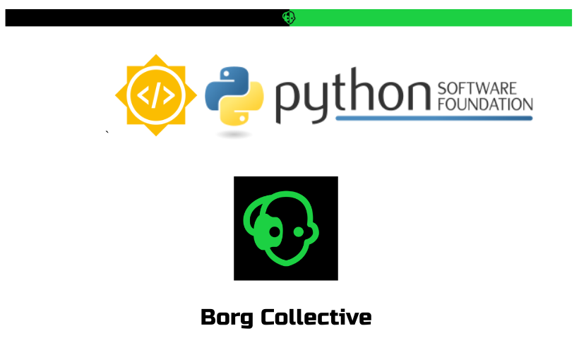

# Google Summer of Code 2023 Final Report
## Python Software Foundation - Borg Collective
 

**Contributor**: [Divyansh Singh (divi)](https://github.com/diivi)

**Proposal Link**: [Borg Collective: Divyansh Singh GSoC 2023 Proposal](https://blogs.python-gsoc.org/media/proposals/GSoC_Proposal_DIvi_2023.pdf)

**Organization**: [Python Software Foundation](https://python-gsoc.org/)

**Sub-Organization**: [Borg Collective](https://github.com/borgbackup/borg)

**Project**: [Borg Collective: Add beginner-friendly features and enhance the capabilities of Vorta & Borgmatic.](https://summerofcode.withgoogle.com/programs/2023/projects/0i8Q6ZrE)

**Mentors**: [Dan Helfman (witten)](https://github.com/witten), [Manuel Riel (m3nu)](https://github.com/m3nu), [Julian Hofer](https://github.com/Hofer-Julian), [real-yfprojects](https://github.com/real-yfprojects)

## Project Overview
Borg Collective is a well-known organization that offers a range of Python-based backup tools, including Borg, Borgmatic, and Vorta.

Borg is a file backup tool that performs tasks like compression, encryption, authentication, and data deduplication.

Vorta is a desktop GUI for Borg, and Borgmatic is a CLI wrapper around it. With this project, I improved Vorta by adding some essential features that users have frequently requested. I ennhanced its user experience, making it easier for beginners to use, also designing and developing new interfaces along the way. 

As for Borgmatic, I expanded its already powerful capabilities, particularly in the areas of database backups and restores. I also helped decrease the number of unresolved issues in the Borgmatic repository and worked closely with project maintainers and users to incorporate more features into the project.

## Project Achievements

1. **A new and improved GUI dialog** in Vorta for managing exclusion rules before creating a backup.

   Before
   
   

   After
   
   [New Exclude GUI](https://github.com/borgbase/vorta/assets/41837037/f7bf556a-77a2-4708-a5ba-a5f6bda1f641)

3. **Enhanced the archive table by adding Quality of Life improvements** like allowing users to rename an archive by double-clicking on it, and adding a new column to display whether the archive was created by the user or by the scheduler.
   

   Also made it possible for users to refresh multiple archives at once, instead of one at a time, which was bad UX.

   

   Added a "Quick Mount" button to the archive table, which allows users to mount an archive with a single click to a temporary location. This is useful for quickly accessing files from a backup archive without having to restore the entire archive, or creating a folder and then mounting the archive to it.

   
  
3. borgmatic - [Add functionality to support restoring a database dump to a different hostname/port/username than the ones used to create the dump.](https://github.com/borgmatic-collective/borgmatic/pull/73)
   
   This was a frequently requested feature and I worked on adding these parameters to the borgmatic configuration file and CLI arguments.
   
   I was also responsible for actually checking and executing the restores for all the databases that borgmatic supports, namely - PostgreSQL, MySQL, MariaDB, MongoDB and SQLite. I learned how to write tests extensively for this project, and also how to use Docker to test the database restores.

   

4. [Bootstrap a borgmatic restore from nothing](https://github.com/borgmatic-collective/borgmatic/pull/71) - This was another frequently requested feature, that would turn out to be a lifesaver for many users. It allows users to **restore their entire borgmatic-created backup, without having a borgmatic configuration file**. This is useful in cases where the user has lost their configuration file, or if they are trying to restore a backup created by someone else, or even when the user has lost access to everything except the backup archive.

   The solution was designed and implemented completely by me from scratch, thanks to the trust that Dan had in me. I learned a lot about the internals of borgmatic and Borg while working on this feature, and also how to write tests for it. The testing was one of the most challenging parts of this feature, as it required me to mock a lot of things, and I had never written tests so extensively before.

   The solution involved storing the borgmatic configuration file in the backup archive itself, and then using that to restore the backup. This was a very interesting solution, and I learned a lot about how to use Borg to add extra borgmatic metadata to the backup archive.

   

## What's next?

I learned a lot this GSoC, and made some great connections along the way. I plan to continue contributing to the Borg Collective, assisting Dan in maintaining borgmatic, and also helping out with Vorta.

I also aim to bring and assist new contributors in getting started with the projects, and to help them with any issues they might face along the way. If the Borg Collective participates in GSoC again, I'd love to help out the new students by reviewing their proposals and pull requests.

## Challenges and Takeaways

## Acknowledgements

## All Pull Requests
